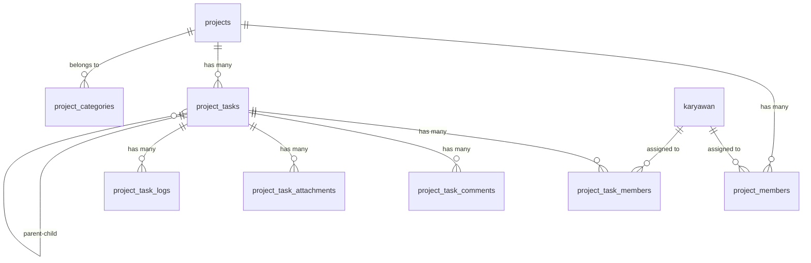

# PRD: Fitur Project Management

**Versi Dokumen:** 1.0
**Tanggal:** 31 Mei 2026
**Penulis:** AI Assistant
**Status:** Draft — Menunggu Review

---

## 1. Ringkasan Eksekutif

Fitur **Project Management** adalah modul baru untuk aplikasi Presensi GPS V2 yang memungkinkan admin/manajer membuat project, menugaskan karyawan ke dalam project, serta memantau progress pengerjaan secara real-time. Fitur ini terintegrasi dengan data karyawan, departemen, dan cabang yang sudah ada di sistem.

---

## 2. Latar Belakang & Tujuan

### Masalah
- Belum ada cara terpusat untuk mengelola project dan tugas karyawan di dalam aplikasi.
- Monitoring progress pekerjaan masih dilakukan secara manual (WA, spreadsheet, dsb).
- Tidak ada riwayat (history) pengerjaan tugas yang terdokumentasi.

### Tujuan
1. Menyediakan **project board** tempat admin/manajer dapat membuat dan mengelola project.
2. Menyediakan mekanisme **penugasan (task assignment)** ke karyawan.
3. Menyediakan **tracking progress** pengerjaan setiap task.
4. Menyediakan **dashboard ringkasan** dan **laporan** project.
5. Mengirimkan **notifikasi push** ke karyawan saat ditugaskan atau ada update project.

---

## 3. Target Pengguna (User Persona)

| Peran | Akses |
|---|---|
| **Super Admin / Admin** | CRUD project, kelola semua project, assign task, lihat semua laporan |
| **Manager / Kepala Departemen** | CRUD project di departemennya, assign task, approve progress |
| **Karyawan** | Melihat task yang ditugaskan, update progress, upload bukti |

---

## 4. Fitur & Fungsionalitas

### 4.1. Manajemen Project

| Fitur | Deskripsi |
|---|---|
| Buat Project | Admin/manager membuat project baru dengan nama, deskripsi, tanggal mulai, deadline, prioritas, dan status |
| Edit Project | Mengubah detail project |
| Hapus Project | Soft delete project (arsipkan) |
| Status Project | `planning` → `in_progress` → `completed` → `on_hold` → `cancelled` |
| Prioritas | `low`, `medium`, `high`, `critical` |
| Kategori | Kategorisasi project (opsional) |
| Anggota Project | Assign beberapa karyawan sebagai anggota project |

### 4.2. Manajemen Task (Penugasan)

| Fitur | Deskripsi |
|---|---|
| Buat Task | Membuat task di dalam project, assign ke satu atau lebih karyawan |
| Sub-Task | Task dapat memiliki parent task (hierarki 1 level) |
| Prioritas Task | `low`, `medium`, `high`, `critical` |
| Status Task | `todo` → `in_progress` → `review` → `completed` → `cancelled` |
| Deadline Task | Setiap task punya deadline sendiri |
| Lampiran | Upload file/foto sebagai lampiran task |

### 4.3. Progress & Log Aktivitas

| Fitur | Deskripsi |
|---|---|
| Update Progress | Karyawan mengupdate persentase progress (0-100%) |
| Komentar | Karyawan/manager dapat memberikan komentar di setiap task |
| Log Aktivitas | Otomatis mencatat setiap perubahan status, progress, dan komentar |
| Upload Bukti | Karyawan dapat upload foto/file sebagai bukti pengerjaan |

### 4.4. Dashboard & Laporan

| Fitur | Deskripsi |
|---|---|
| Dashboard Project | Ringkasan semua project: total, aktif, selesai, terlambat |
| Gantt Chart (opsional) | Visualisasi timeline project dan task |
| Laporan per Karyawan | Berapa task yang ditugaskan, selesai, pending per karyawan |
| Laporan per Project | Progress keseluruhan project, list task, status masing-masing |
| Filter & Pencarian | Filter by status, prioritas, tanggal, departemen, karyawan |

### 4.5. Notifikasi

| Event | Channel |
|---|---|
| Karyawan ditugaskan ke project/task | Push + Database |
| Deadline H-1 | Push + Database |
| Task status berubah | Database |
| Komentar baru di task | Database |

---

## 5. Perancangan Database (ERD)

### 5.1. Diagram Relasi



### 5.2. Detail Tabel

#### Tabel `project_categories`

Kategorisasi project (opsional, master data).

| Kolom | Tipe | Constraint | Keterangan |
|---|---|---|---|
| `id` | bigint unsigned | PK, auto increment | |
| `nama_kategori` | varchar(100) | NOT NULL | Nama kategori |
| `deskripsi` | text | NULLABLE | Deskripsi kategori |
| `warna` | varchar(7) | NULLABLE | Kode warna HEX untuk badge |
| `created_at` | timestamp | | |
| `updated_at` | timestamp | | |

---

#### Tabel `projects`

Menyimpan data project utama.

| Kolom | Tipe | Constraint | Keterangan |
|---|---|---|---|
| `id` | bigint unsigned | PK, auto increment | |
| `kode_project` | varchar(20) | UNIQUE, NOT NULL | Kode unik project (auto-generate: PRJ-YYYYMM-001) |
| `nama_project` | varchar(255) | NOT NULL | Nama project |
| `deskripsi` | text | NULLABLE | Deskripsi detail project |
| `category_id` | bigint unsigned | FK → project_categories.id, NULLABLE | Kategori project |
| `kode_dept` | char(3) | FK → departemen.kode_dept, NULLABLE | Departemen pemilik project |
| `kode_cabang` | char(3) | FK → cabang.kode_cabang, NULLABLE | Cabang pemilik project |
| `created_by` | varchar(20) | FK → karyawan.nik | NIK pembuat project |
| `start_date` | date | NOT NULL | Tanggal mulai |
| `end_date` | date | NOT NULL | Tanggal deadline |
| `status` | enum | NOT NULL, default 'planning' | `planning`, `in_progress`, `completed`, `on_hold`, `cancelled` |
| `prioritas` | enum | NOT NULL, default 'medium' | `low`, `medium`, `high`, `critical` |
| `progress` | tinyint unsigned | default 0 | Progress keseluruhan (0-100), dihitung otomatis |
| `budget` | decimal(15,2) | NULLABLE | Anggaran project (opsional) |
| `catatan` | text | NULLABLE | Catatan tambahan |
| `completed_at` | timestamp | NULLABLE | Waktu selesai |
| `created_at` | timestamp | | |
| `updated_at` | timestamp | | |
| `deleted_at` | timestamp | NULLABLE | Soft delete |

**Index:**
- `idx_projects_status` → (`status`)
- `idx_projects_kode_dept` → (`kode_dept`)
- `idx_projects_created_by` → (`created_by`)
- `idx_projects_dates` → (`start_date`, `end_date`)

---

#### Tabel `project_members`

Relasi many-to-many antara project dan karyawan (anggota project).

| Kolom | Tipe | Constraint | Keterangan |
|---|---|---|---|
| `id` | bigint unsigned | PK, auto increment | |
| `project_id` | bigint unsigned | FK → projects.id, ON DELETE CASCADE | |
| `nik` | varchar(20) | FK → karyawan.nik, ON DELETE CASCADE | NIK karyawan |
| `role` | enum | NOT NULL, default 'member' | `leader`, `member` |
| `joined_at` | timestamp | NOT NULL | Tanggal join project |
| `created_at` | timestamp | | |
| `updated_at` | timestamp | | |

**Unique Constraint:** `(project_id, nik)` — satu karyawan hanya bisa jadi anggota satu kali per project.

---

#### Tabel `project_tasks`

Menyimpan daftar task/penugasan dalam sebuah project.

| Kolom | Tipe | Constraint | Keterangan |
|---|---|---|---|
| `id` | bigint unsigned | PK, auto increment | |
| `project_id` | bigint unsigned | FK → projects.id, ON DELETE CASCADE | |
| `parent_id` | bigint unsigned | FK → project_tasks.id, NULLABLE, ON DELETE CASCADE | ID parent task (untuk sub-task) |
| `kode_task` | varchar(30) | UNIQUE, NOT NULL | Kode unik task (auto-generate: TSK-YYYYMM-001) |
| `judul` | varchar(255) | NOT NULL | Judul task |
| `deskripsi` | text | NULLABLE | Deskripsi detail |
| `status` | enum | NOT NULL, default 'todo' | `todo`, `in_progress`, `review`, `completed`, `cancelled` |
| `prioritas` | enum | NOT NULL, default 'medium' | `low`, `medium`, `high`, `critical` |
| `progress` | tinyint unsigned | default 0 | Progress (0-100) |
| `start_date` | date | NULLABLE | Tanggal mulai task |
| `due_date` | date | NULLABLE | Deadline task |
| `completed_at` | timestamp | NULLABLE | Waktu selesai |
| `urutan` | integer | default 0 | Urutan tampil |
| `created_by` | varchar(20) | FK → karyawan.nik | NIK pembuat task |
| `created_at` | timestamp | | |
| `updated_at` | timestamp | | |

**Index:**
- `idx_tasks_project_status` → (`project_id`, `status`)
- `idx_tasks_parent` → (`parent_id`)
- `idx_tasks_due_date` → (`due_date`)

---

#### Tabel `project_task_members`

Karyawan yang ditugaskan ke task tertentu.

| Kolom | Tipe | Constraint | Keterangan |
|---|---|---|---|
| `id` | bigint unsigned | PK, auto increment | |
| `task_id` | bigint unsigned | FK → project_tasks.id, ON DELETE CASCADE | |
| `nik` | varchar(20) | FK → karyawan.nik, ON DELETE CASCADE | NIK karyawan yang ditugaskan |
| `assigned_at` | timestamp | NOT NULL | Tanggal penugasan |
| `created_at` | timestamp | | |
| `updated_at` | timestamp | | |

**Unique Constraint:** `(task_id, nik)`

---

#### Tabel `project_task_comments`

Komentar/diskusi pada task.

| Kolom | Tipe | Constraint | Keterangan |
|---|---|---|---|
| `id` | bigint unsigned | PK, auto increment | |
| `task_id` | bigint unsigned | FK → project_tasks.id, ON DELETE CASCADE | |
| `nik` | varchar(20) | FK → karyawan.nik, ON DELETE CASCADE | NIK yang berkomentar |
| `komentar` | text | NOT NULL | Isi komentar |
| `created_at` | timestamp | | |
| `updated_at` | timestamp | | |

---

#### Tabel `project_task_attachments`

File lampiran pada task.

| Kolom | Tipe | Constraint | Keterangan |
|---|---|---|---|
| `id` | bigint unsigned | PK, auto increment | |
| `task_id` | bigint unsigned | FK → project_tasks.id, ON DELETE CASCADE | |
| `nik` | varchar(20) | FK → karyawan.nik, ON DELETE CASCADE | NIK yang upload |
| `nama_file` | varchar(255) | NOT NULL | Nama file asli |
| `path` | varchar(500) | NOT NULL | Path file di storage |
| `tipe_file` | varchar(50) | NULLABLE | MIME type |
| `ukuran` | bigint unsigned | NULLABLE | Ukuran file dalam bytes |
| `created_at` | timestamp | | |
| `updated_at` | timestamp | | |

---

#### Tabel `project_task_logs`

Log aktivitas otomatis untuk audit trail.

| Kolom | Tipe | Constraint | Keterangan |
|---|---|---|---|
| `id` | bigint unsigned | PK, auto increment | |
| `task_id` | bigint unsigned | FK → project_tasks.id, ON DELETE CASCADE | |
| `nik` | varchar(20) | FK → karyawan.nik, NULLABLE | NIK yang melakukan aksi |
| `aksi` | varchar(50) | NOT NULL | Jenis aksi: `created`, `status_changed`, `progress_updated`, `member_added`, `member_removed`, `comment_added`, `attachment_added` |
| `data_lama` | json | NULLABLE | Nilai sebelum perubahan |
| `data_baru` | json | NULLABLE | Nilai setelah perubahan |
| `keterangan` | text | NULLABLE | Deskripsi perubahan dalam bahasa manusia |
| `created_at` | timestamp | | |

---

## 6. Perancangan Model (Eloquent)

### 6.1. Daftar Model

| Model | Tabel | Namespace |
|---|---|---|
| `ProjectCategory` | `project_categories` | `App\Models` |
| `Project` | `projects` | `App\Models` |
| `ProjectMember` | `project_members` | `App\Models` |
| `ProjectTask` | `project_tasks` | `App\Models` |
| `ProjectTaskMember` | `project_task_members` | `App\Models` |
| `ProjectTaskComment` | `project_task_comments` | `App\Models` |
| `ProjectTaskAttachment` | `project_task_attachments` | `App\Models` |
| `ProjectTaskLog` | `project_task_logs` | `App\Models` |

### 6.2. Relasi Utama

```php
// Model Project
class Project extends Model
{
    // Project belongsTo Category
    public function category() → belongsTo(ProjectCategory)
    
    // Project hasMany Members
    public function members() → hasMany(ProjectMember)
    
    // Project hasMany Tasks
    public function tasks() → hasMany(ProjectTask)
    
    // Project belongsTo Creator (Karyawan)
    public function creator() → belongsTo(Karyawan, 'created_by', 'nik')
    
    // Project belongsTo Departemen
    public function departemen() → belongsTo(Departemen, 'kode_dept', 'kode_dept')
    
    // Project belongsTo Cabang
    public function cabang() → belongsTo(Cabang, 'kode_cabang', 'kode_cabang')
    
    // Auto-calculate progress dari rata-rata progress task
    public function calculateProgress()
}

// Model ProjectTask
class ProjectTask extends Model
{
    // Task belongsTo Project
    public function project() → belongsTo(Project)
    
    // Task has sub-tasks
    public function subtasks() → hasMany(ProjectTask, 'parent_id')
    
    // Task belongsTo parent
    public function parent() → belongsTo(ProjectTask, 'parent_id')
    
    // Task hasMany assigned members
    public function members() → hasMany(ProjectTaskMember)
    
    // Task hasMany comments
    public function comments() → hasMany(ProjectTaskComment)
    
    // Task hasMany attachments
    public function attachments() → hasMany(ProjectTaskAttachment)
    
    // Task hasMany logs
    public function logs() → hasMany(ProjectTaskLog)
}
```

---

## 7. Perancangan Controller

| Controller | Route Prefix | Deskripsi |
|---|---|---|
| `ProjectCategoryController` | `/projectcategory` | CRUD kategori project |
| `ProjectController` | `/project` | CRUD project, dashboard |
| `ProjectTaskController` | `/project/{id}/task` | CRUD task dalam project |
| `ProjectTaskCommentController` | `/project/task/{id}/comment` | Komentar di task |
| `ProjectMobileController` | `/karyawan/project` | Tampilan project untuk karyawan mobile |

---

## 8. Perancangan Route

```php
// ============================================================
// ADMIN/MANAGER ROUTES — Project Management
// ============================================================

// Kategori Project
Route::controller(ProjectCategoryController::class)->group(function () {
    Route::get('/projectcategory', 'index')->name('projectcategory.index');
    Route::get('/projectcategory/create', 'create')->name('projectcategory.create');
    Route::post('/projectcategory', 'store')->name('projectcategory.store');
    Route::get('/projectcategory/{id}/edit', 'edit')->name('projectcategory.edit');
    Route::put('/projectcategory/{id}', 'update')->name('projectcategory.update');
    Route::delete('/projectcategory/{id}', 'destroy')->name('projectcategory.delete');
});

// Project
Route::controller(ProjectController::class)->group(function () {
    Route::get('/project', 'index')->name('project.index');
    Route::get('/project/create', 'create')->name('project.create');
    Route::post('/project', 'store')->name('project.store');
    Route::get('/project/{id}', 'show')->name('project.show');
    Route::get('/project/{id}/edit', 'edit')->name('project.edit');
    Route::put('/project/{id}', 'update')->name('project.update');
    Route::delete('/project/{id}', 'destroy')->name('project.delete');
    Route::post('/project/{id}/addmember', 'addMember')->name('project.addmember');
    Route::delete('/project/{id}/removemember/{nik}', 'removeMember')->name('project.removemember');
});

// Task
Route::controller(ProjectTaskController::class)->group(function () {
    Route::get('/project/{projectId}/task/create', 'create')->name('project.task.create');
    Route::post('/project/{projectId}/task', 'store')->name('project.task.store');
    Route::get('/project/task/{id}', 'show')->name('project.task.show');
    Route::get('/project/task/{id}/edit', 'edit')->name('project.task.edit');
    Route::put('/project/task/{id}', 'update')->name('project.task.update');
    Route::delete('/project/task/{id}', 'destroy')->name('project.task.delete');
    Route::post('/project/task/{id}/progress', 'updateProgress')->name('project.task.progress');
    Route::post('/project/task/{id}/status', 'updateStatus')->name('project.task.status');
    Route::post('/project/task/{id}/comment', 'storeComment')->name('project.task.comment');
    Route::post('/project/task/{id}/attachment', 'storeAttachment')->name('project.task.attachment');
    Route::delete('/project/task/attachment/{id}', 'deleteAttachment')->name('project.task.attachment.delete');
});

// ============================================================
// KARYAWAN MOBILE ROUTES
// ============================================================
Route::controller(ProjectMobileController::class)->group(function () {
    Route::get('/myproject', 'index')->name('myproject.index');
    Route::get('/myproject/{id}', 'show')->name('myproject.show');
    Route::get('/myproject/task/{id}', 'showTask')->name('myproject.task.show');
    Route::post('/myproject/task/{id}/progress', 'updateProgress')->name('myproject.task.progress');
    Route::post('/myproject/task/{id}/comment', 'storeComment')->name('myproject.task.comment');
    Route::post('/myproject/task/{id}/attachment', 'storeAttachment')->name('myproject.task.attachment');
});
```

---

## 9. Perancangan Permission (Spatie)

| Permission | Deskripsi |
|---|---|
| `project.index` | Melihat daftar project |
| `project.create` | Membuat project baru |
| `project.edit` | Mengedit project |
| `project.delete` | Menghapus project |
| `project.show` | Melihat detail project |
| `project.task.create` | Membuat task |
| `project.task.edit` | Mengedit task |
| `project.task.delete` | Menghapus task |
| `project.task.assign` | Menugaskan karyawan ke task |
| `project.report` | Melihat laporan project |
| `projectcategory.index` | Melihat kategori project |
| `projectcategory.create` | Membuat kategori project |
| `projectcategory.edit` | Mengedit kategori project |
| `projectcategory.delete` | Menghapus kategori project |

**Permission Group:** `Project Management`

---

## 10. Perancangan Notifikasi

### 10.1. Notification Class

| Kelas | Event | Channel |
|---|---|---|
| `ProjectAssignedNotification` | Karyawan ditugaskan ke project | Push + Database |
| `TaskAssignedNotification` | Karyawan ditugaskan ke task | Push + Database |
| `TaskStatusChangedNotification` | Status task berubah | Database |
| `TaskDeadlineReminderNotification` | H-1 deadline task | Push + Database |
| `TaskCommentNotification` | Ada komentar baru di task | Database |

### 10.2. Contoh Payload Push

```php
// TaskAssignedNotification
return (new WebPushMessage)
    ->title('Penugasan Baru 📋')
    ->body('Anda ditugaskan pada task: ' . $this->task->judul)
    ->icon($icon)
    ->badge(asset('assets/img/icon-96x96.png'))
    ->data([
        'action_url' => route('myproject.task.show', $this->task->id)
    ]);
```

---

## 11. Perancangan View (Blade)

### 11.1. Halaman Admin/Manager

| File | Path | Deskripsi |
|---|---|---|
| `index.blade.php` | `resources/views/project/index.blade.php` | Daftar semua project + statistik |
| `create.blade.php` | `resources/views/project/create.blade.php` | Form buat project baru |
| `edit.blade.php` | `resources/views/project/edit.blade.php` | Form edit project |
| `show.blade.php` | `resources/views/project/show.blade.php` | Detail project + daftar task + anggota |
| `task/create.blade.php` | `resources/views/project/task/create.blade.php` | Form buat task |
| `task/edit.blade.php` | `resources/views/project/task/edit.blade.php` | Form edit task |
| `task/show.blade.php` | `resources/views/project/task/show.blade.php` | Detail task + komentar + log |
| `category/index.blade.php` | `resources/views/project/category/index.blade.php` | Master kategori project |

### 11.2. Halaman Mobile Karyawan

| File | Path | Deskripsi |
|---|---|---|
| `index.blade.php` | `resources/views/project/mobile/index.blade.php` | Daftar project saya |
| `show.blade.php` | `resources/views/project/mobile/show.blade.php` | Detail project + task saya |
| `task_show.blade.php` | `resources/views/project/mobile/task_show.blade.php` | Detail task + update progress |

---

## 12. Wireframe Konsep UI

### 12.1. Dashboard Project (Admin)
```
┌──────────────────────────────────────────────────────┐
│  📊 Dashboard Project Management                     │
├────────┬────────┬────────┬────────┬─────────────────│
│ Total  │ Aktif  │ Selesai│ Overdue│ Ditunda          │
│  15    │   8    │   5    │   1    │   1              │
├────────┴────────┴────────┴────────┴─────────────────│
│                                                      │
│  🔍 [Search...] [Filter Status ▼] [+ Buat Project]  │
│                                                      │
│  ┌──────────────────────────────────────────────┐    │
│  │ PRJ-202605-001 | Website Redesign            │    │
│  │ 🟢 In Progress | ⚡ High | 🏢 IT Dept        │    │
│  │ ████████░░ 75% | 📅 01 Jun - 30 Jul 2026    │    │
│  │ 👥 5 anggota | 📋 12 task (8 selesai)        │    │
│  └──────────────────────────────────────────────┘    │
│                                                      │
│  ┌──────────────────────────────────────────────┐    │
│  │ PRJ-202605-002 | Mobile App Development      │    │
│  │ 🔵 Planning | 🔴 Critical | 🏢 Dev Dept      │    │
│  │ ██░░░░░░░░ 20% | 📅 15 Jun - 15 Sep 2026   │    │
│  │ 👥 8 anggota | 📋 25 task (5 selesai)        │    │
│  └──────────────────────────────────────────────┘    │
└──────────────────────────────────────────────────────┘
```

### 12.2. Detail Project — Task Board
```
┌──────────────────────────────────────────────────────────┐
│  📋 Website Redesign                    [Edit] [Anggota] │
│  Progress: ████████░░ 75%                                │
├──────────────┬──────────────┬──────────────┬────────────│
│   📥 TODO    │ 🔄 PROGRESS  │ 👀 REVIEW   │ ✅ DONE    │
│    (3)       │    (4)       │    (1)       │   (8)      │
├──────────────┼──────────────┼──────────────┼────────────│
│ ┌──────────┐ │ ┌──────────┐ │ ┌──────────┐ │ ┌────────┐│
│ │ Design   │ │ │ Backend  │ │ │ Testing  │ │ │ Wirefrm││
│ │ Header   │ │ │ API User │ │ │ Login    │ │ │ Home   ││
│ │ ⚡High    │ │ │ 🔵Med    │ │ │ 🔵Med    │ │ │ ✅Done ││
│ │ 👤 Budi  │ │ │ 👤 Ani   │ │ │ 👤 Dedi  │ │ │ 👤 Rina││
│ │ 📅 5 Jun │ │ │ ██████░ │ │ │ 📅 10Jun │ │ │        ││
│ └──────────┘ │ │ 60%     │ │ └──────────┘ │ └────────┘│
│              │ └──────────┘ │              │           │
│ ┌──────────┐ │              │              │           │
│ │ Design   │ │ ┌──────────┐ │              │           │
│ │ Footer   │ │ │ Frontend │ │              │           │
│ │ 🟢Low    │ │ │ Dashboard│ │              │           │
│ │ 👤 -     │ │ │ ⚡High    │ │              │           │
│ │ 📅 7 Jun │ │ │ 👤 Budi  │ │              │           │
│ └──────────┘ │ │ ████░░░ │ │              │           │
│              │ │ 40%     │ │              │           │
│              │ └──────────┘ │              │           │
└──────────────┴──────────────┴──────────────┴────────────┘
```

### 12.3. Tampilan Mobile Karyawan
```
┌─────────────────────────┐
│ 📋 Project Saya         │
│                         │
│ ┌─────────────────────┐ │
│ │ Website Redesign    │ │
│ │ ████████░░ 75%      │ │
│ │ 📅 Deadline: 30 Jul │ │
│ │ 📋 3 task aktif     │ │
│ └─────────────────────┘ │
│                         │
│ Task Saya Hari Ini:     │
│                         │
│ ┌─────────────────────┐ │
│ │ 🔄 Design Header    │ │
│ │ ⚡ High Priority     │ │
│ │ 📅 5 Jun 2026       │ │
│ │ Progress: ███░░ 60% │ │
│ │ [Update Progress]   │ │
│ └─────────────────────┘ │
│                         │
│ ┌─────────────────────┐ │
│ │ 📥 Frontend Dashboard│ │
│ │ ⚡ High Priority     │ │
│ │ 📅 15 Jun 2026      │ │
│ │ Progress: █░░░ 20%  │ │
│ │ [Update Progress]   │ │
│ └─────────────────────┘ │
└─────────────────────────┘
```

---

## 13. Tahapan Implementasi (Roadmap)

### Tahap 1: Foundation — Database & Model (Estimasi: 2-3 hari)

| # | Langkah | Detail | Status |
|---|---|---|---|
| 1.1 | Buat migration `project_categories` | Tabel master kategori | [x] Selesai |
| 1.2 | Buat migration `projects` | Tabel utama project | [x] Selesai |
| 1.3 | Buat migration `project_members` | Tabel anggota project | [x] Selesai |
| 1.4 | Buat migration `project_tasks` | Tabel task/penugasan | [x] Selesai |
| 1.5 | Buat migration `project_task_members` | Tabel penugasan task ke karyawan | [x] Selesai |
| 1.6 | Buat migration `project_task_comments` | Tabel komentar task | [x] Selesai |
| 1.7 | Buat migration `project_task_attachments` | Tabel lampiran task | [x] Selesai |
| 1.8 | Buat migration `project_task_logs` | Tabel log aktivitas | [x] Selesai |
| 1.9 | Jalankan `php artisan migrate` | Migrasi database | [x] Selesai |
| 1.10 | Buat semua Model Eloquent beserta relasi | 8 model | [x] Selesai |
| 1.11 | Buat Seeder permission project management | Seeder untuk Spatie permissions | [x] Selesai |

### Tahap 2: Backend — Controller & Route (Estimasi: 3-4 hari)

| # | Langkah | Detail | Status |
|---|---|---|---|
| 2.1 | Buat `ProjectCategoryController` | CRUD kategori | [x] Selesai |
| 2.2 | Buat `ProjectController` | CRUD project + manage members | [x] Selesai |
| 2.3 | Buat `ProjectTaskController` | CRUD task + progress + komentar + attachment | [x] Selesai |
| 2.4 | Buat `ProjectMobileController` | Endpoint untuk tampilan mobile karyawan | [x] Selesai |
| 2.5 | Daftarkan semua route di `web.php` | Lengkap dengan middleware & permission | [x] Selesai |
| 2.6 | Buat helper `generateKodeProject()` | Auto-generate kode project | [x] Selesai |
| 2.7 | Buat helper `generateKodeTask()` | Auto-generate kode task | [x] Selesai |
| 2.8 | Buat logic auto-calculate project progress | Rata-rata progress dari semua task | [x] Selesai |

### Tahap 3: Frontend Admin — View Blade (Estimasi: 4-5 hari)

| # | Langkah | Detail | Status |
|---|---|---|---|
| 3.1 | Buat view master kategori project | CRUD sederhana dengan DataTable | [x] Selesai |
| 3.2 | Buat view daftar project (index) | List + statistik + filter | [x] Selesai |
| 3.3 | Buat view form create/edit project | Form input dengan select karyawan | [x] Selesai |
| 3.4 | Buat view detail project (show) | Detail project + Kanban board task | [x] Selesai |
| 3.5 | Buat view form create/edit task | Form input + assign member | [x] Selesai |
| 3.6 | Buat view detail task | Detail + komentar + lampiran + log | [x] Selesai |
| 3.7 | Tambahkan menu sidebar Project Management | Link di menu admin | [x] Selesai |


### Tahap 4: Frontend Mobile — View Karyawan (Estimasi: 2-3 hari)

| # | Langkah | Detail | Status |
|---|---|---|---|
| 4.1 | Buat view daftar project saya | Card-based list project | [ ] Belum |
| 4.2 | Buat view detail project mobile | Detail + list task saya | [ ] Belum |
| 4.3 | Buat view detail task mobile | Detail + update progress + komentar | [ ] Belum |
| 4.4 | Buat slider/input progress update | Slider 0-100% + tombol submit | [ ] Belum |
| 4.5 | Buat form upload lampiran mobile | File picker + preview | [ ] Belum |
| 4.6 | Tambahkan menu Project di navigasi mobile | Bottom nav atau sidebar | [ ] Belum |

### Tahap 5: Notifikasi & Finishing (Estimasi: 2-3 hari)

| # | Langkah | Detail | Status |
|---|---|---|---|
| 5.1 | Buat `ProjectAssignedNotification` | Push + Database notification | [ ] Belum |
| 5.2 | Buat `TaskAssignedNotification` | Push + Database notification | [ ] Belum |
| 5.3 | Buat `TaskDeadlineReminderNotification` | Push + Database notification | [ ] Belum |
| 5.4 | Buat scheduler untuk deadline reminder | Laravel Task Scheduler: cek H-1 deadline | [ ] Belum |
| 5.5 | Buat laporan project (export PDF/Excel) | Opsional | [ ] Belum |
| 5.6 | Testing keseluruhan fitur | End-to-end testing | [ ] Belum |
| 5.7 | Optimasi query & indexing | Review performa database | [ ] Belum |

---

## 14. Total Estimasi Waktu

| Tahap | Estimasi |
|---|---|
| Tahap 1 — Database & Model | 2-3 hari |
| Tahap 2 — Controller & Route | 3-4 hari |
| Tahap 3 — Frontend Admin | 4-5 hari |
| Tahap 4 — Frontend Mobile | 2-3 hari |
| Tahap 5 — Notifikasi & Finishing | 2-3 hari |
| **Total** | **13-18 hari kerja** |

---

## 15. Pertimbangan Teknis

### 15.1. Storage
- File lampiran disimpan di `storage/app/public/project-attachments/{project_id}/{task_id}/`
- Gunakan symbolic link: `php artisan storage:link`
- Batasi ukuran file: **max 10MB per file**
- Tipe file yang diizinkan: `jpg, jpeg, png, gif, pdf, doc, docx, xls, xlsx, ppt, pptx, zip`

### 15.2. Performance
- Eager loading untuk relasi nested (project → tasks → members)
- Gunakan database indexing pada kolom yang sering di-query (status, kode_dept, due_date)
- Pagination pada daftar project dan task
- Cache dashboard statistics (opsional)

### 15.3. Security
- Semua route dilindungi middleware `auth` dan `can` (Spatie Permission)
- Karyawan hanya bisa melihat project yang mereka ikuti
- Validasi kepemilikan sebelum update/delete
- Sanitasi input untuk mencegah XSS pada komentar

### 15.4. Integrasi dengan Fitur yang Sudah Ada
- **Karyawan:** Menggunakan tabel `karyawan` yang sudah ada (PK: `nik`)
- **Departemen:** Filter project berdasarkan `kode_dept`
- **Cabang:** Filter project berdasarkan `kode_cabang`
- **Approval (opsional fase 2):** Integrasi dengan sistem approval yang sudah ada menggunakan polymorphic `approvals` table
- **Notifikasi:** Menggunakan pattern yang sama dengan `SlipgajiNotification` dan `PengumumanNotification`

---

## 16. Risiko & Mitigasi

| Risiko | Mitigasi |
|---|---|
| Database query lambat saat project banyak | Indexing, pagination, eager loading |
| File attachment membludak | Batasi ukuran file, auto cleanup file lama |
| Konflik ketika banyak user update progress bersamaan | Optimistic locking atau last-write-wins |
| Karyawan bingung navigasi | Desain UI sederhana, panduan pengguna |

---

## 17. Metrik Keberhasilan

- [ ] Admin dapat membuat, mengedit, dan menghapus project
- [ ] Admin dapat menugaskan karyawan ke project dan task
- [ ] Karyawan menerima notifikasi push saat ditugaskan
- [ ] Karyawan dapat melihat dan mengupdate progress task
- [ ] Progress project dihitung otomatis dari rata-rata progress task
- [ ] Log aktivitas tercatat untuk setiap perubahan
- [ ] Laporan project dapat diakses oleh admin

---

## Changelog

| Versi | Tanggal | Perubahan |
|---|---|---|
| 1.0 | 31 Mei 2026 | Dokumen PRD awal |
| 1.1 | 31 Mei 2026 | Selesai pengerjaan Tahap 1 (Database & Model) |
| 1.2 | 31 Mei 2026 | Selesai pengerjaan Tahap 2 (Backend Controllers & Routes) |
| 1.3 | 31 Mei 2026 | Selesai pengerjaan Tahap 3 (Frontend Admin Views & Task views) |
